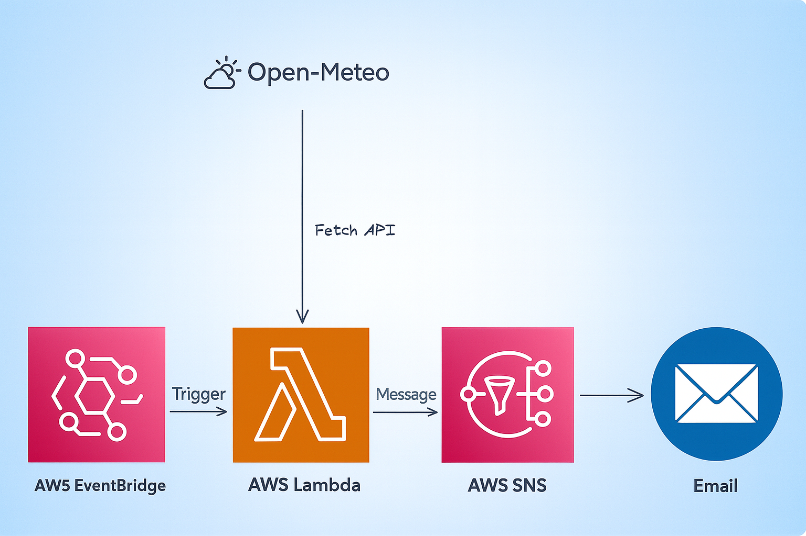

[](https://www.python.org/)
[](https://aws.amazon.com/lambda/)
[](https://aws.amazon.com/eventbridge/)
[](https://aws.amazon.com/sns/)
[](https://boto3.amazonaws.com/)
## Sobre o Projeto
Este projeto publica mensagens em um **tópico SNS** com base em dados de previsão do tempo.  
Ele pode ser executado **localmente** (interpretador Python) ou em uma **AWS Lambda** acionada por uma regra do **EventBridge**.

---
## Esquema do Projeto

## Como fazer o setup do projeto

### Pré-requisitos
- Python 3.x
- `pip` e `venv`
- Credenciais AWS **somente para execução local** (na Lambda use o *execution role*)

### Passos (local)
1. **Clone** o repositório e entre na pasta do projeto.
2. **Crie e ative** o ambiente virtual:
   ```bash
   # Linux/macOS
   python -m venv .venv
   source .venv/bin/activate

   # Windows (PowerShell)
   python -m venv .venv
   .\.venv\Scripts\Activate.ps1
   ```
3. **Instale** as dependências:
   ```bash
   pip install -r requirements.txt
   ```
4. **Crie** o arquivo `.env` a partir do `env-example` e preencha:
   ```dotenv
   # credenciais SOMENTE para execução local
   AWS_ACCESS_KEY_ID=
   AWS_SECRET_ACCESS_KEY=
   SNS_ARN="arn:aws:sns:us-west-1:123456789012:Weather_Sender"
   lat=
   long=
   ```
5. **Execute** o projeto localmente (ajuste o entrypoint conforme seu código):
   ```bash
   python src/main.py
   ```
   > Dica: se for usar `python-dotenv`, mantenha o `from dotenv import load_dotenv` para execução local.

### Observações
- **Nunca** faça commit de chaves no repositório.
- Em produção (Lambda), **não** use chaves de usuário; use **IAM Role**.

---

## Como configurar a Role no IAM (para a Lambda)

A Lambda precisa de um **Execution Role** que permita publicar no seu tópico SNS.

### 1) Trust policy
Crie uma role (ex.: `SNS-Weather-Role`) com a *trust policy* abaixo:
```json
{
  "Version": "2012-10-17",
  "Statement": [
    {
      "Effect": "Allow",
      "Principal": { "Service": "lambda.amazonaws.com" },
      "Action": "sts:AssumeRole"
    }
  ]
}
```

### 2) Permissão mínima (PoLP) para publicar no SNS
Anexe uma **inline policy** permitindo **apenas** o seu tópico:
```json
{
  "Version": "2012-10-17",
  "Statement": [
    {
      "Sid": "AllowPublishToWeatherSender",
      "Effect": "Allow",
      "Action": "sns:Publish",
      "Resource": "arn:aws:sns:us-west-1:123456789012:Weather_Sender"
    }
  ]
}
```


---

## Como configurar o Lambda

1. **Crie** uma função Lambda (Runtime **Python 3.x**).
2. **Selecione** a **Execution Role** criada (`SNS-Weather-Role`).
3. Em **Configuration → Environment variables**, defina:
   - `SNS_ARN` — ARN do tópico SNS
   - `lat` — latitude (ex.: `-23.55`)
   - `long` — longitude (ex.: `-46.63`)
4. **Dependências**:
   - A Lambda já inclui `boto3`.  
   - Se você usava `python-dotenv` apenas para local, **remova a importação** na versão enviada para a Lambda ou inclua via **Lambda Layer** (opcional), caso passe via **lambda**, não é necessario criar variaveis de ambiente na **AWS** e sim no **.env**.
5. **Região**: no código, crie o client SNS com a mesma região do tópico:
   ```python
   import os, boto3

   sns = boto3.client("sns", region_name="us-west-1")
   resp = sns.publish(
       TopicArn=os.environ["SNS_ARN"],
       Message="Teste",
       Subject="Teste" 
   )
   ```
6. Faça um **Test** na própria Lambda para validar.

---

## Como configurar no EventBridge

Você pode usar:
- **EventBridge (Rules)** → cron **em UTC**, ou
- **EventBridge Scheduler** → cron **com fuso horário** (recomendado).

### Opção A) EventBridge **Rules** (UTC)
Brasil (America/Sao_Paulo) é UTC-3.  
Ex.: rodar **diariamente às 06:00 (BR)** → **09:00 UTC**:

- **Cron (UTC)**: `cron(0 9 * * ? *)`

Passos:
1. **Crie** a **Rule** com o cron acima.
2. **Adicione** sua **Lambda** como **Target**.
3. Em **Permissions**, garanta que a Lambda permite invocação pelo EventBridge (o console costuma criar isso automaticamente).

### Opção B) **EventBridge Scheduler** (com fuso)
Sem precisar converter fuso:

- **Cron**: `cron(0 6 * * ? *)`  
- **Timezone**: `America/Sao_Paulo`

No console:
1. **Crie** um **Schedule** do tipo cron, defina `cron(0 6 * * ? *)`.
2. **Defina** o **Time zone** como `America/Sao_Paulo`.
3. Em **Target**, selecione a **Lambda** e informe um **Role** que permita o Scheduler invocar a função (o console também cria se você deixar).

---
## Tecnologias utilizadas

- **AWS Lambda**: Computação *serverless* que executa seu código sob demanda ou em horários definidos.
- **Python (3.x)**: Linguagem principal do projeto.

- **Amazon EventBridge**: Serviço de eventos e agendamento. Neste projeto, aciona a Lambda diariamente.  

- **Amazon SNS (Simple Notification Service)**: Mensageria *pub/sub* para distribuir notificações a múltiplos assinantes (E-mail, SQS, Lambda, HTTP).


## Troubleshooting rápido

- **AuthorizationError (sns:Publish)**: falta permissão no **Execution Role** da Lambda. Anexe a policy de `sns:Publish` com o **ARN correto**.
- **InvalidParameter: TopicArn**: ARN vazio/errado ou região do client diferente da região do tópico.
- **FIFO sem MessageGroupId**: inclua `MessageGroupId` no `publish`.
- **Variáveis ausentes**: confira `SNS_ARN`, `lat`, `long` nas **env vars** da Lambda.
